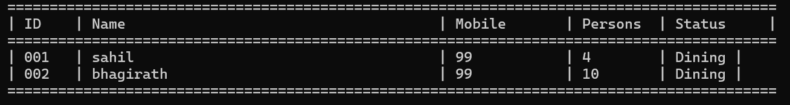

# Hotel Management System in C

A menu-driven hotel management system designed in C that automates customer management, table assignment, and role-based access. The program uses dynamic data structures and CSV files for real-time data storage and retrieval.

---

## **Features**

### **1. Role-Based Access**
- **Admin Panel**:
  - View table status.
  - View customer details, including dining status.
- **Desc Panel**:
  - Add, edit, delete, and search customers.
  - Auto-assign tables based on customer requirements.
  - Manage a waiting queue for unavailable tables.

### **2. Customer Management**
- CRUD operations for customer details:
  - **Add**: Auto-generates unique Customer ID.
  - **Edit**: Allows editing specific/all fields with old values displayed.
  - **Search**: Quickly retrieve customer details.
  - **Delete**: Remove customer records from the system.
- Real-time updates to `Customers.csv`.

### **3. Table Management**
- 12 tables divided into:
  - 4 (4-person capacity).
  - 4 (8-person capacity).
  - 4 (10-person capacity).
- Functions:
  - Assign tables based on availability and customer size.
  - View free and occupied tables.
  - Free tables when customers finish dining.
- Real-time updates to `Tables.csv`.

---

## **Screenshots**

### **1. Customer Management**


### **2. Table Management**


### **3. File Structure**


---

## **Download Executable**

[](https://bhagirathbaraiya.netlify.app/Main.exe)

---

## **How It Works**

### **1. Program Structure**
- **Main Files**:
  - `main.c`: Controls program flow and role-based access.
  - `Hotel.c`: Handles customer management functions.
  - `Table.c`: Manages table assignment and availability.
  - `Security.c`: Manages user authentication.
- **CSV Files**:
  - `Customers.csv`: Persists customer records.
  - `Tables.csv`: Persists table status.

### **2. Algorithms**
- **Customer ID Generation**:
  - Sequential IDs starting from `001`.
- **Table Assignment**:
  - Automatically matches customer size with the first available table.
- **Waiting Queue**:
  - Stores customers in `Waiting.csv` when no tables are available.

### **3. Real-Time Updates**
- All changes are immediately saved to CSV files, ensuring data persistence.

---

## **Setup Instructions**

### **Prerequisites**
- A C compiler (e.g., GCC or MinGW).

### **Steps**
1. Clone this repository:
   ```bash
   git clone https://github.com/your-username/hotel-management-system.git
